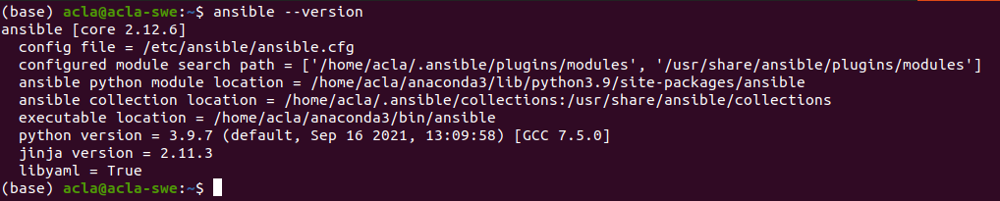
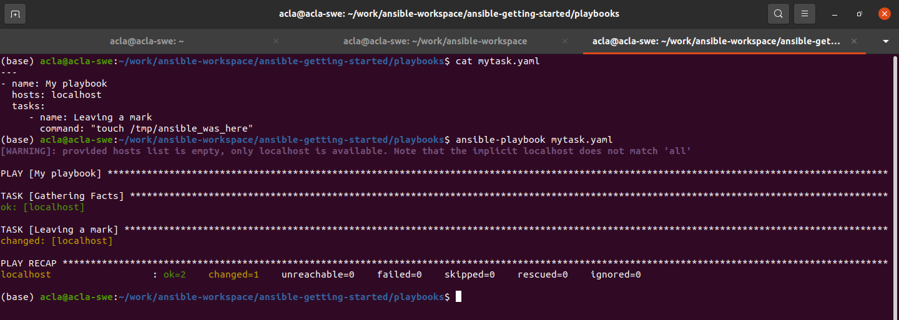

### Requirement
Installed ansible on your local machine



check all my inventory hosts are ready to be managed by ansible
```
ansible all -m ping
```
run the uptime command on all hosts in the web group
```
ansible web -m command -a "uptime"
```
collect and display the discovered for the localhost
```
ansible localhost -m setup
```
### ansible playbooks
installing apache
```
- name: install and start apache
  hosts: web
  vars:
    http_port: 80
    max_clients: 200
  remote_user: root

  tasks:
  - name: install httpd
    yum: pkg=httpd state=latest
  - name: write the apache config file
    template: src=/srv/httpd.j2 dest=/etc/httpd.conf
  - name: start httpd
    services: name=httpd state=started
```
simplicity always recommend to name the playbook
```
- hosts: web
  name: install and start apache
  tasks:
    - name: install apache packages
      yum:
        name: httpd
        state: latest
    - name: start apache service
      services:
        name: httpd
        state: started
        enabled: yes
```
### Inventory
```
10.1.2.75
10.1.5.45
10.1.4.5
10.1.0.40

w14301.example.com
w17802.example.com
w19203.example.com
w19304.example.com
```

### Action: run your first Ansible commands
test ansible
```
ansible all -m ping
```
output :
```
aserver.example.org | SUCCESS => {
    "ansible_facts": {
        "discovered_interpreter_python": "/usr/bin/python"
    },
    "changed": false,
    "ping": "pong"
}
```
Now run a live command on all of your nodes
```
ansible all -a "/bin/echo hello"
```
output :
```
aserver.example.org | CHANGED | rc=0 >>
hello
```


test ansible with localhost
```
ansible localhost -a "/bin/echo hello"
```
output:
```
localhost | CHANGED | rc=0 >>
hello
```

### Run ansible playbook
create mytask.yaml
```
---
- name: My playbook
  hosts: all
  tasks:
     - name: Leaving a mark
       command: "touch /tmp/ansible_was_here"
```
for localhost :
```
---
- name: My playbook
  hosts: localhost
  tasks:
     - name: Leaving a mark
       command: "touch /tmp/ansible_was_here"
```
run mytask.yaml
```
ansible-playbook mytask.yaml
```


### references from official ansible docs:
- [>video<](https://www.ansible.com/resources/videos/quick-start-video?extIdCarryOver=true&sc_cid=701f2000001OH7YAAW)
- [>installing<](https://docs.ansible.com/ansible/latest/installation_guide/intro_installation.html#prerequisites)
- [>getting-started<](https://docs.ansible.com/ansible/latest/user_guide/intro_getting_started.html#intro-getting-started)